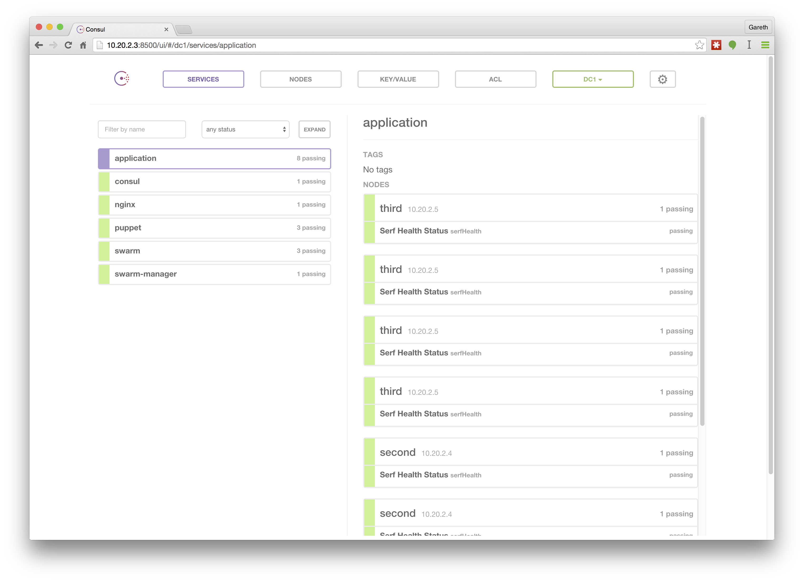

# Puppet Enterprise and Service Discovery with Consul

An example using Puppet Enterprise to drive Consul and Docker. And of
using Consul to drive Puppet. Specifically this example:

* Sets up a 4 node Puppet Enterprise cluster
* Installs Docker Swarm on the agent nodes
* Installs a Consul master and a Swarm manager on the `first` node
* Installs Docker and runs several application containers on the
  `second` and `third` nodes
* Runs an nginx proxy on the `first` node that load balances between the
  application containers
* If you add or remove application containers from consul they should be
  automatically added or removed from the proxy. This is done via a
  consul watcher triggering a Puppet run on `first` whenever the service
  list changes

This was put together to act as material for a talk at Loadays
entitled [Service discovery and configuration management](http://loadays.org/pages/service_discovery_cfgmgmt.html).


## Usage

You'll need to tell Oscar about Puppet Enterprise. First download the
tar and run:

    vagrant pe-build copy puppet-enterprise-3.7.2-ubuntu-14.04-amd64.tar.gz

You should then be able to launch the 4 virtual machines using:

    vagrant up --provider virtualbox

You should be able to access the Consul dashboard at [10.20.2.2:8500](http://10.20.2.2:8500/)
and the load balanced containers at [10.20.2.2](http://10.20.2.2/). You
should be able to get to something like the following:




## Why

This is partly an experiment in the use of service discovery tools
(in this case Consul) alongside Puppet. One of the obvious benefits is
cross-node communication made possible when things change.


## How

The interesting bits of the code are in the profile classes, in particular in
[modules/profiles/manifests](modules/profiles/manifests/application.pp) which
contains this defined type which brigs together Docker and Consul.

```puppet
define application(
  $port,
) {
  ::docker::run { $title:
    image   => 'nginx',
    ports   => ["${port}:80"],
    volumes => "/var/www/${title}:/usr/share/nginx/html:ro",
  }

  file { "/var/www/${title}":
    ensure => directory,
  }

  file { "/var/www/${title}/index.html":
    ensure  => present,
    content => "${title} running on ${::hostname}",
  }

  ::consul::service { "application-${title}":
    service_name => 'application',
    port         => $port,
  }
}
```

And in [modules/profiles/manifests/webserver.pp](modules/profiles/manifests/webserver.pp)
which watches for changes in the above registered services and runs Puppet.

```puppet
::consul::watch { 'detect_backend_changes':
  type        => 'service',
  handler     => '/usr/bin/runpuppet.sh',
  service     => 'application',
  passingonly => true,
  require     => File['/usr/bin/runpuppet.sh'],
}
```


## Thanks

Important parts of the puzzle are built using:

* [Oscar](https://github.com/adrienthebo/oscar) to create a Puppet Enterprise sandbox.
* [garethr-docker](https://forge.puppetlabs.com/garethr/docker) to
  install Docker and run the containers
* [KyloeAnderson-consul](https://forge.puppetlabs.com/KyleAnderson/consul)
  which installs Consul and allows for registering services and watchers
* [lynxman-hiera_consul](https://forge.puppetlabs.com/lynxman/hiera_consul)
  which acts as a Hiera backend for Consul


## Puppet Enterprise

Included for reference if you're experimenting with Puppet Enterprise as well.

### Console

You should be able to access the [main dashboard](https://10.20.1.2/)
using `admin` and `puppetlabs` as the username and password. It's
possible the address will be different, at which point 'vagrant ssh
master' and `ifconfig` should let you find the correct IP.


### Inventory service

The inventory service is running on port `8140`. Locally you can access
that with:

    curl -k https://localhost:18140/production/facts/master

Note that this currently needs an update to the auth.conf file
at `/etc/puppetlabs/puppet/auth.conf` to add:

    path /facts
    auth any
    method find, search
    allow *

[More details about auth.conf](http://docs.puppetlabs.com/guides/rest_auth_conf.html)
and about [the inventory service](http://docs.puppetlabs.com/guides/inventory_service.html)


### PuppetDB

PuppetDB is running an exposed on all interfaces. Access the
[dashboard](http://localhost:18080/dashboard/index.html) or try out the API:

    curl http://localhost:18080/v2/nodes
